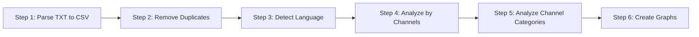

# 📺 YouTube History Analyzer

A comprehensive Python toolkit for parsing, analyzing, and visualizing YouTube viewing history data. This project transforms raw YouTube history into meaningful insights through data cleaning, language detection, AI-powered categorization, and rich visualizations.

## 🚀 Features

- **Smart Parsing**: Handles complex YouTube history formats with "Mark as watched" entries
- **Duplicate Detection**: Identifies and removes duplicate video entries
- **Language Detection**: Automatically detects Russian (Cyrillic) vs English (Latin) content
- **AI Categorization**: Uses Google Gemini 2.0 Flash to intelligently categorize channels into topics
- **Rich Visualizations**: Generates 6 comprehensive graphs analyzing viewing patterns
- **Channel Analysis**: Groups videos by channel with detailed statistics
- **Robust Processing**: Handles rate limits and errors gracefully

## 🔄 Project Workflow



## 📊 Generated Visualizations

### Channel Analysis
1. **`top_channels_by_count.png`** - Top channels by video count (with language breakdown)
2. **`top_channels_by_time.png`** - Top channels by watch time (with language breakdown)

### Language Analysis  
3. **`language_distribution.png`** - Russian vs English content by video count
4. **`watch_time_by_language.png`** - Russian vs English content by watch time

### Category Analysis
5. **`categories_by_video_count.png`** - Top categories by video count (with language breakdown)
6. **`categories_by_watch_time.png`** - Top categories by watch time (with language breakdown)

## 🛠️ Scripts Overview

### Core Processing Pipeline

#### 1. `parser.py`
**Purpose**: Parses raw YouTube history text file into structured CSV format
```bash
python parser.py
```
**Input**: `history.txt` (raw YouTube history)  
**Output**: `youtube_history.csv`  
**Features**:
- Handles "Mark as watched" lines that appear between video entries
- Extracts video titles, channel names, and durations
- Robust error handling for malformed entries
- Supports both English and Russian history exports: detects "Now playing" and "Текущее видео"

#### 2. `remove_duplicates.py`
**Purpose**: Identifies and removes duplicate video entries
```bash
python remove_duplicates.py
```
**Input**: `youtube_history.csv`  
**Output**: `youtube_history_clean.csv`  
**Logic**: Removes duplicates based on video title + channel name combination

#### 3. `add_language_column.py`
**Purpose**: Adds language detection (Russian vs English)
```bash
python add_language_column.py
```
**Input**: `youtube_history_clean.csv`  
**Output**: `youtube_history_with_language.csv`  
**Method**: Uses regex to detect Cyrillic characters for Russian content

#### 4. `analyze_by_channels.py`
**Purpose**: Groups videos by channel with comprehensive statistics
```bash
python analyze_by_channels.py
```
**Outputs**:
- `channel_analysis.csv`: Summary statistics per channel
- `videos_by_channel.csv`: Detailed video listings grouped by channel

#### 5. `add_categories.py`
**Purpose**: AI-powered categorization of channels using Google Gemini **with intelligent caching**
```bash
python add_categories.py
```
**Input**: `youtube_history_with_language.csv`  
**Output**: `youtube_history_with_categories.csv {timestamp}.csv`  
**Categories**: AI, F1, Football, Basketball, News, Humor, Popular Science, History, Superheroes, Other

**🚀 Smart Caching System:**
- **Cache File**: `channel_categories.json` - stores channel-to-category mappings
- **Performance**: Only categorizes NEW channels, skips known ones from cache
- **Cost Savings**: Dramatically reduces API calls (98%+ cache hit rate typical)
- **Speed**: Known channels processed instantly from cache
- **Auto-backup**: Creates timestamped backups before cache updates

**AI Features**:
- Uses Gemini 2.0 Flash with temperature 0 for consistent categorization
- Respects API rate limits (15 RPM for free tier)
- Infinite retry logic - never gives up on categorization
- Exponential backoff for rate limit handling
- Only initializes AI when unknown channels are found

### Analysis Scripts

#### 6. `create_graphs.py`
**Purpose**: Generates channel and language visualization graphs
```bash
python create_graphs.py
```
**Outputs**: 4 PNG graphs showing channel rankings and language distribution

#### 7. `create_category_graphs.py`
**Purpose**: Generates category-based visualization graphs
```bash
python create_category_graphs.py
```
**Outputs**: 2 PNG graphs showing category analysis with language breakdowns

### Utility Scripts

#### 8. `check_categories.py`
**Purpose**: Quick statistics view of categorization results
```bash
python check_categories.py
```

## 📋 Requirements

### Docker (Recommended)
- Docker
- Docker Compose

### Local Installation
```txt
pandas>=2.0.0
matplotlib>=3.5.0
google-generativeai>=0.3.0
python-dotenv>=1.0.0
numpy>=1.21.0
```

Install dependencies:
```bash
pip install -r requirements.txt
# or manually:
pip install pandas matplotlib google-generativeai python-dotenv
```

## ⚙️ Setup

### 1. Environment Configuration
Create a `.env` file with your Gemini API key:
```env
GEMINI_API_KEY=your_api_key_here
```

### 2. Input Data
Place your YouTube history in `history.txt` format.

Supported markers for video blocks:
- English export: `Now playing`
- Russian export: `Текущее видео`

Examples:
```
Now playing
Video Title Here
Channel Name Here
MM:SS

Now playing
Another Video Title
Another Channel
H:MM:SS
```

Troubleshooting:
- If no videos are found, ensure your export contains one of the supported markers above
- Ensure `history.txt` is saved to disk before running via Docker (mounted as read-only)

### 3. Run the Pipeline

#### Option A: Using Docker (Recommended)
The easiest way to run the analyzer without installing dependencies:

```bash
# Build and run with docker-compose
docker-compose up --build

# Or build manually
docker build -t youtube-analyzer .
docker run -v $(pwd)/history.txt:/app/history.txt:ro -v $(pwd)/.env:/app/.env:ro -v $(pwd)/output:/app/output youtube-analyzer
```

Docker setup includes:
- ✅ All dependencies pre-installed
- 🔒 Isolated environment
- 📁 Automatic output directory mapping
- 🚀 One-command execution

Notes:
- The container reads `history.txt` and `.env` from your host via read-only mounts
- Outputs (CSVs/PNGs) are written to the `output/` directory on your host
- If you changed `history.txt` in your editor, make sure it is saved before running Docker

#### Option B: Automated Pipeline (Local)
Run the complete pipeline with a single command:
```bash
python run_pipeline.py
```

This script will:
- ✅ Check prerequisites (history.txt and .env files)
- 🔄 Execute all 7 pipeline steps in correct order
- 📊 Provide progress feedback and timing information
- ❌ Stop on errors with clear error messages
- 🎉 Display summary of generated files

#### Option C: Manual Execution
Execute scripts individually in order:
```bash
python parser.py
python remove_duplicates.py
python add_language_column.py
python analyze_by_channels.py
python add_categories.py
python create_graphs.py
python create_category_graphs.py
```

## 📁 File Structure

```
YouTube_history_analyzer/
├── 📄 Core Scripts
│   ├── run_pipeline.py               # 🚀 Run complete pipeline
│   ├── parser.py                     # Parse raw history
│   ├── remove_duplicates.py          # Remove duplicate entries
│   ├── add_language_column.py        # Add language detection
│   ├── add_categories.py             # AI categorization
│   ├── analyze_by_channels.py        # Channel analysis
│   ├── create_graphs.py              # Channel/language graphs
│   └── create_category_graphs.py     # Category graphs
│
├── 📊 Data Files
│   ├── history.txt                   # Raw input data (git-ignored)
│   ├── channel_categories.json       # 💾 Cache file for categorizations
│   ├── youtube_history.csv           # Parsed data
│   ├── youtube_history_clean.csv     # Deduplicated data
│   ├── youtube_history_with_language.csv  # With language detection
│   ├── youtube_history_with_categories.csv # Final categorized data
│   ├── channel_analysis.csv          # Channel statistics
│   └── videos_by_channel.csv         # Videos grouped by channel
│
├── 📈 Visualizations (git-ignored)
│   ├── top_channels_by_count.png     # Top channels by video count
│   ├── top_channels_by_time.png      # Top channels by watch time
│   ├── language_distribution.png     # Language split by count
│   ├── watch_time_by_language.png    # Language split by time
│   ├── categories_by_video_count.png # Categories by video count
│   └── categories_by_watch_time.png  # Categories by watch time
│
├── 🔧 Utilities
│   ├── check_categories.py           # View categorization stats
│   ├── .gitignore                    # Git ignore patterns
│   ├── .env                          # API keys (git-ignored)
│   └── README.md                     # This file
│
├── 🐳 Docker Files
│   ├── Dockerfile                    # Docker image definition
│   ├── docker-compose.yml            # Docker compose configuration
│   ├── .dockerignore                 # Docker ignore patterns
│   └── requirements.txt              # Python dependencies
```

## 🎯 Key Features & Innovations

### Smart Parsing
- Handles YouTube's inconsistent export format
- Manages "Mark as watched" interruptions
- Extracts duration in multiple formats (MM:SS, H:MM:SS)

### Language Detection
- Cyrillic character detection for Russian content
- Automatic categorization without external APIs
- High accuracy for bilingual viewing patterns

### AI Categorization
- Uses Google Gemini 2.0 Flash for intelligent categorization
- Analyzes both channel names and video titles
- Temperature 0 for consistent results
- Never gives up - infinite retry with exponential backoff

### Rich Visualizations
- Stacked bar charts with language breakdowns
- Color-coded by language (Red: Russian, Teal: English)
- Professional formatting with value labels
- Multiple perspectives: count vs time analysis

## 📊 Sample Analysis Results

### Example Category Breakdown
```
📺 By Video Count:
   AI: 22 videos (🇷🇺 0 | 🇺🇸 22)
   F1: 10 videos (🇷🇺 6 | 🇺🇸 4)
   FOOTBALL: 7 videos (🇷🇺 7 | 🇺🇸 0)
   HISTORY: 6 videos (🇷🇺 6 | 🇺🇸 0)

⏱️ By Watch Time:
   AI: 5h 50m (🇷🇺 0m | 🇺🇸 5h 50m)
   F1: 4h 29m (🇷🇺 3h 55m | 🇺🇸 33m)
   NEWS: 3h 24m (🇷🇺 3h 24m | 🇺🇸 0m)
```

## 🔒 Privacy & Security

- All data files are git-ignored for privacy
- API keys stored in environment variables
- No data is transmitted except to Gemini API for categorization
- Local processing ensures data privacy

## 🚧 Error Handling

### Rate Limiting
- Respects Gemini API free tier limits (15 RPM)
- Automatic retry with exponential backoff
- Handles daily quota limits gracefully

### Data Quality
- Validates API responses against expected categories
- Handles malformed duration strings
- Graceful fallbacks for parsing errors
- Recognizes both English and Russian history formats ("Now playing" / "Текущее видео")

## 🎨 Customization

### Adding Categories
Modify the category list in `add_categories.py`:
```python
valid_categories = ['AI', 'F1', 'Football', 'Basketball', 'News', 'Humor', 'Popular Science', 'History', 'Superheroes', 'Other', 'YOUR_CATEGORY']
```

### Visualization Colors
Update color schemes in graph scripts:
```python
colors = {'Russian': '#FF6B6B', 'English': '#4ECDC4'}
```

### Analysis Periods
Filter data by date ranges before analysis:
```python
df = df[df['Date'] > '2024-01-01']  # Analyze recent data only
```

## 💾 Cache Management

### Understanding the Cache System
The categorization system uses `channel_categories.json` to store channel-to-category mappings:
```json
{
  "OpenAI": "AI",
  "Гаснут Огни": "F1", 
  "Портье Дрогба": "FOOTBALL"
}
```

### Cache Operations
**View cache stats:**
```bash
python -c "
import json
with open('channel_categories.json', 'r', encoding='utf-8') as f:
    cache = json.load(f)
print(f'Cache contains {len(cache)} channels')
"
```

**Extract cache from existing data:**
```bash
python -c "
import pandas as pd, json
df = pd.read_csv('your_categorized_file.csv')
cache = df.groupby('Название канала')['Category'].first().to_dict()
with open('channel_categories.json', 'w', encoding='utf-8') as f:
    json.dump(cache, f, ensure_ascii=False, indent=2)
"
```

**Manually edit categories:**
Edit `channel_categories.json` directly to fix incorrect categorizations, then re-run the script.

### Performance Benefits
- **First run**: Normal speed (all channels categorized)
- **Subsequent runs**: 98%+ faster (only new channels categorized)
- **API cost savings**: Up to 98% reduction in AI API calls
- **Cache hit rate**: Typically >95% for established datasets

### Best Practices
1. **Backup cache**: Keep multiple versions of `channel_categories.json`
2. **Version control**: Include cache file in your repository for team sharing
3. **Quality check**: Periodically review categorizations for accuracy
4. **Fresh start**: Delete cache file to re-categorize all channels if needed

## 🤝 Contributing

1. Fork the repository
2. Create a feature branch
3. Make your changes
4. Test thoroughly
5. Submit a pull request

## 📝 License

This project is open source and available under the MIT License.

---

**Created with 🧠 AI assistance for comprehensive YouTube viewing analysis** 